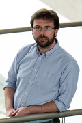

# Instructors

The course will be taught by:

## Eric J Pedersen

 
 
 

## Gavin Simpson

Gavin is a research scientist at the Institute of Environmental Change and Society, University Regina, Canada. He started using R (just) before version 1.0 was released and has maintains several R packages as well as contributing to and helping to maintain the popular `vegan` package. A (palaeo)limnologist and (palaeo)ecologist by training, Gavin is particularly interested in community dynamics in time (OK, and space) and as such invariably finds himself non-linear models to stubbornly-complicated time series data with `mgcv`.

 
 
 

## David L Miller

Dave is a scientific programmer at Integrated Statistics in Woods Hole, MA and an honourary fellow of the University of St Andrews, Scotland. Having completed his PhD with Simon Wood in 2012, he's spent a lot of time thinking about how to model the spatial distribution of animal populations, most recently North Atlantic right whales. `mgcv` is his go to tool for building complex spatial models.

 
 
 

